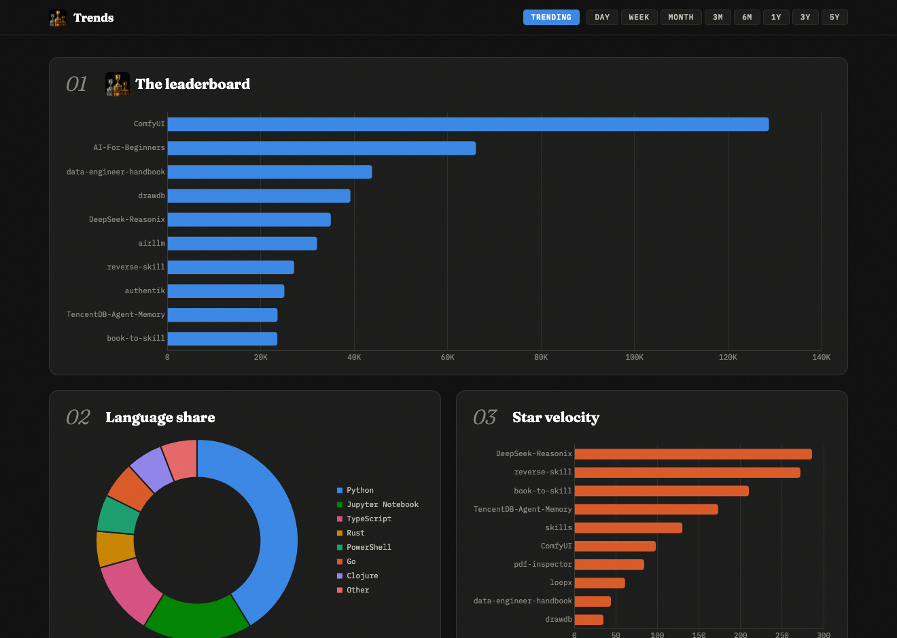
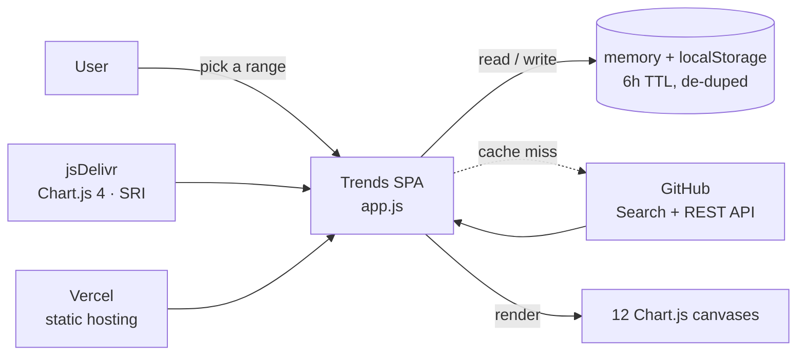
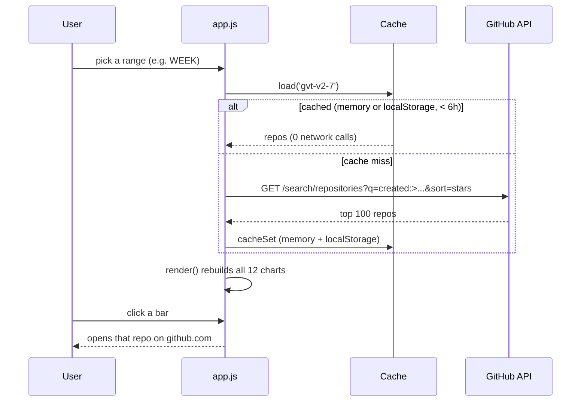

# Trends

[github.com/trending](https://github.com/trending) is a list. Lists hide the story. Trends pulls
GitHub's rising repositories and turns them into **12 animated Chart.js visualizations** that tell
the story - who is winning, in which language, at what velocity, and how lopsided the race really is.



[](LICENSE)


## Contents

- [Features](#features)
- [The 12 charts](#the-12-charts)
- [Architecture](#architecture)
- [How it works](#how-it-works)
- [Design decisions and trade-offs](#design-decisions-and-trade-offs)
- [Tech stack](#tech-stack)
- [Quick start](#quick-start)
- [Configuration](#configuration)
- [Project layout](#project-layout)
- [License](#license)

## Features

- **12 animated visualizations** of GitHub trending, each captioned with the story it tells.
- **A curated TRENDING view** (the default) plus **8 time ranges** - day, week, month, 3m, 6m, 1y, 3y, 5y.
- **Cache-first data layer** - every view calls GitHub at most once, then serves from an in-memory
  cache and `localStorage` (6-hour TTL), with in-flight de-duplication so a rapid click never
  fires a second request.
- **Click any repo** - bars in the leaderboard, velocity, stars-vs-forks, and issues charts open
  that repository on GitHub.
- **Responsive** - one chart per row on a phone, two side by side on a tablet/desktop, with a
  full-width leaderboard hero. Respects `prefers-reduced-motion`.
- **Colorblind-safe** 8-slot categorical palette validated for adjacent separation and contrast.
- **Zero build, no API key** - plain HTML/CSS/JS, Chart.js from a CDN with an SRI integrity pin.

## The 12 charts

| # | Chart | The story it tells |
|---|-------|--------------------|
| 01 | The leaderboard | Top risers by stars, and how far ahead #1 really is |
| 02 | Language share | Which language owns the trending page |
| 03 | Star velocity | Stars gained per day of life - the steepest climbers |
| 04 | Stars vs forks | Bubble field: watched vs taken-apart (size = open issues) |
| 05 | Stars by language | Total gravity per language |
| 06 | Birth timeline | Which launch day produced the most risers |
| 07 | License picks | How much of trending ships with no license at all |
| 08 | Orgs vs individuals | Who owns the page: companies or solo devs |
| 09 | Average heat per repo | The language that runs hottest per repo |
| 10 | Issue load at the top | The price of fame in open issues |
| 11 | Hot topics | Most-tagged topics across the set |
| 12 | The long tail | Star-class pyramid: how few actually break 1k |

## Architecture

A single-file vanilla-JS SPA. A range filter drives one cache-first fetch, which maps into a
uniform repo shape and rebuilds all 12 Chart.js canvases. No framework, no build step, no backend.



| File | Role |
|------|------|
| `index.html` | Markup, sticky topbar, and the 12 chart cards |
| `app.js` | Cache-first data layer, 12 chart renderers, boot |
| `styles.css` | Dark observatory theme, responsive grid, topbar |

## How it works



## Design decisions and trade-offs

| Decision | Chosen | Alternative | Why this trade-off | Cost we accept |
|----------|--------|-------------|--------------------|----------------|
| Data source | GitHub Search API (`created:>N`, by stars) | scrape `github.com/trending` | there is no official trending API, and the Search API needs no key | short ranges are not literally "gaining stars now", so a curated TRENDING snapshot fills the default view |
| Build | zero-build static (vanilla JS + CDN) | a bundler or framework | open `index.html` and it runs; trivial to host anywhere | no types or tree-shaking; the app is one closure |
| Caching | memory + `localStorage`, 6h, de-duped | fetch on every filter change | respects the 60 requests/hour unauthenticated limit | data can be up to 6 hours stale |
| CDN safety | SRI-pinned Chart.js | a plain `<script>` tag | a poisoned CDN cannot inject code | the integrity hash must be updated on a version bump |

## Tech stack

- **Language** - JavaScript (ES2020+), HTML5, CSS3
- **Charts** - Chart.js 4.4.3 (via jsDelivr CDN, SRI-pinned)
- **Data** - GitHub REST + Search API (unauthenticated)
- **Fonts** - Fraunces + IBM Plex Mono (Google Fonts)
- **Hosting** - Vercel (static)

## Quick start

```bash
git clone https://github.com/bunlongheng/trends.git
cd trends
python3 -m http.server 8080
# open http://localhost:8080
```

No install, no build, no API key - any static file server works. Data is fetched live from the
GitHub API in the browser and cached for 6 hours.

## Configuration

No environment variables required.

## Project layout

```
trends/
├── index.html            # markup, sticky topbar, 12 chart cards
├── app.js                # cache-first data layer + 12 Chart.js renderers
├── styles.css            # dark observatory theme, responsive grid
├── docs/
│   └── screenshots/      # README images
├── icon.png / favicon.*  # app icons
├── LICENSE               # MIT
└── README.md
```

## License

[MIT](LICENSE) (c) Bunlong Heng

---

<p align="center">
  <sub>Built by <a href="https://bunlongheng.com">Bunlong Heng</a> &middot; <a href="https://bunlongheng.com/projects/trends">See it in my portfolio &rarr;</a></sub>
</p>
